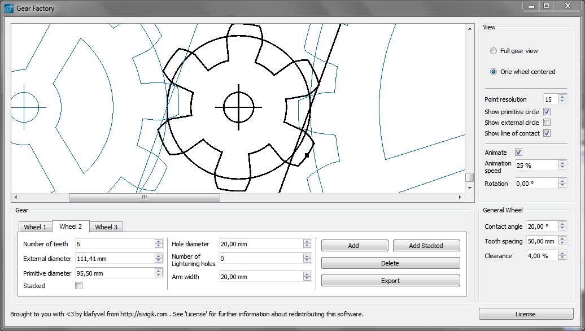

# Gear Factory
A software to generate gears. It uses SVG as an output.

## Screenshot(s)

## Downloads

Gear Factory is available for :
- [Windows 32bits](https://github.com/Klafyvel/GearFactory/releases/download/v0.1-win32/GearFactory_win32.zip)

## License
Under GPLv3, see 'LICENSE'.
